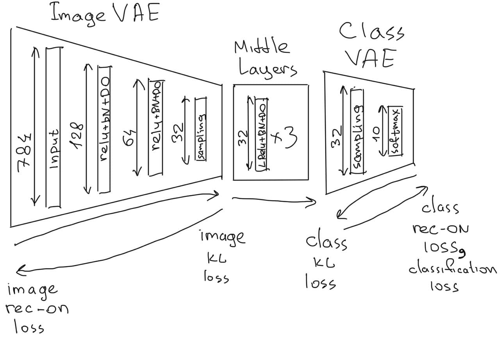
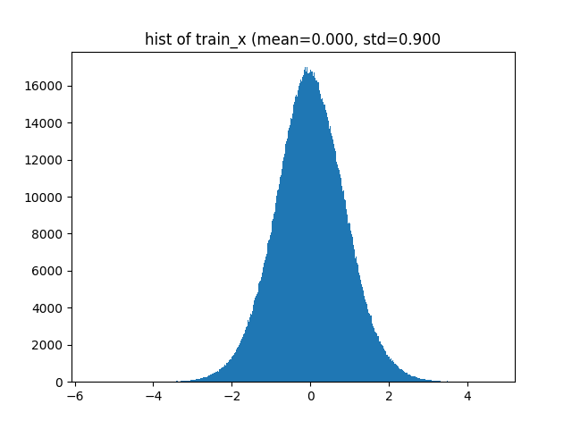
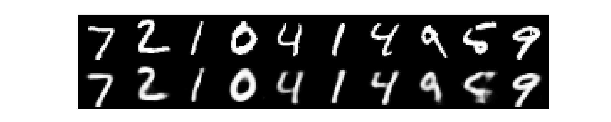
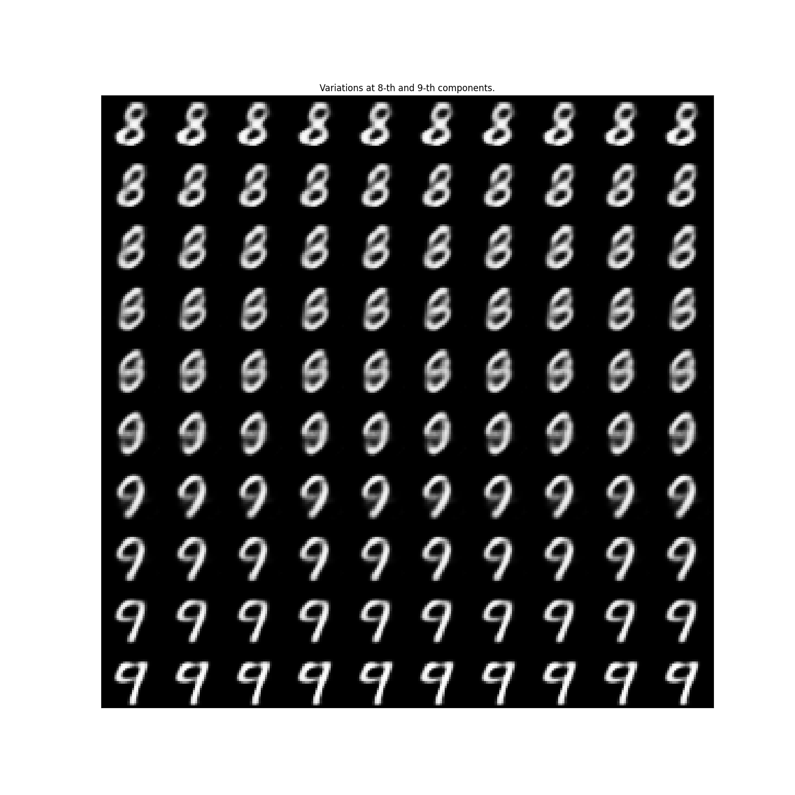

test test test
# Low dimensional MNIST Dataset

When I conduct experiments with custom neural models or alternative training rules, I usually use lightweight datasets such as MNIST, CIFAR or IRIS. But sometimes I am afraid that my experimental models don't work well enough not because they are bad, but because of extra difficulties of the toy tasks. For example MNIST has a significant dimensionality reduction (from 784 to 10). Another difficulty of the MNIST dataset is different input-output data structure and distribution (input is dense black and white pixels and output is a sparse one-hot vector).

Looking for a simpler toy dataset for my experimental models I have created a “Low dimensional MNIST Dataset” where 784-pixels images are mapped to 32-dimensional vectors using VAE and 10-dimensional labels are also mapped to 32-dimensional vectors using VAE. Both of these latent vectors have the same structure and similar distribution. Now I can test my custom models for the ability to map one normally distributed vector to another.



## Download links:
You can create this dataset on your own with any other latent dimension size, or [download mine with 32 dimensions](https://drive.google.com/file/d/11HDpYeC3QomPbuBQ5E1sheGfPVjfIaQs/view?usp=sharing). VAE which I used for dataset creation I have also saved. Using [these models](https://drive.google.com/file/d/1Y6DKTURSCMVJsQC1jpoIGX14nSJEtOUE/view?usp=sharing) you can reconstruct images and labels from your 32-dimensional vectors close to original.


## Dataset statistics.
Both image and class latent vectors follow similar normal distribution. Here is united components hist:

hist_train_x           |  hist_train_y
:-------------------------:|:-------------------------:
 | 

This is per-component mean and std for train_x:

```
train_x mean and std: 0.00025720912 0.9004887
train_y mean and std: 0.0001540213 0.94571745
train_x mean and std of 0-th component: -0.007919223 0.682652
train_y mean and std of 0-th component: -0.007863445 0.68935436
train_x mean and std of 1-th component: -0.0055871555 0.9998354
train_y mean and std of 1-th component: 0.0016339872 1.000652
train_x mean and std of 2-th component: 0.00842828 0.994788
train_y mean and std of 2-th component: -0.0012174535 0.99763507
train_x mean and std of 3-th component: -0.009229124 1.0001135
train_y mean and std of 3-th component: 0.019222299 0.75927085
train_x mean and std of 4-th component: 0.0034513366 0.9960734
train_y mean and std of 4-th component: 0.0018564564 0.9997899
train_x mean and std of 5-th component: 6.5955355e-05 1.004406
train_y mean and std of 5-th component: -0.0015602376 0.9981712
train_x mean and std of 6-th component: 0.008240386 1.0060333
train_y mean and std of 6-th component: 0.0031525765 1.0011075
train_x mean and std of 7-th component: 0.001973462 0.99485004
train_y mean and std of 7-th component: 0.0067345435 0.9959825
train_x mean and std of 8-th component: 0.0076917186 1.001181
train_y mean and std of 8-th component: -0.008808095 0.8035688
train_x mean and std of 9-th component: 0.010729487 0.6762726
train_y mean and std of 9-th component: -0.003938512 0.99524224
train_x mean and std of 10-th component: -0.0051119747 0.6938379
train_y mean and std of 10-th component: -0.0013126589 1.0014544
train_x mean and std of 11-th component: -0.0050557014 0.98911995
train_y mean and std of 11-th component: 0.008341059 0.99950194
train_x mean and std of 12-th component: -0.015286398 0.98782617
train_y mean and std of 12-th component: 0.0033953006 0.9970604
train_x mean and std of 13-th component: -0.0058847493 0.98914236
train_y mean and std of 13-th component: 0.00460219 1.0034823
train_x mean and std of 14-th component: -0.0032727034 0.9932214
train_y mean and std of 14-th component: 0.008159215 0.99760365
train_x mean and std of 15-th component: -0.0069473316 0.6830051
train_y mean and std of 15-th component: -0.0043296916 1.003897
train_x mean and std of 16-th component: -0.0009672241 0.99483496
train_y mean and std of 16-th component: -0.004180189 0.9990054
train_x mean and std of 17-th component: 0.033506572 0.674132
train_y mean and std of 17-th component: -0.00049437856 0.9991869
train_x mean and std of 18-th component: -0.0065310653 0.9942314
train_y mean and std of 18-th component: 0.0036296628 0.72137934
train_x mean and std of 19-th component: 0.00056886725 1.0054618
train_y mean and std of 19-th component: 0.0014175241 1.0038445
train_x mean and std of 20-th component: 0.009434124 0.6793435
train_y mean and std of 20-th component: -0.0027357887 0.996511
train_x mean and std of 21-th component: 0.010010433 0.6853582
train_y mean and std of 21-th component: 0.0016559344 0.79170996
train_x mean and std of 22-th component: -0.0050438605 0.6779194
train_y mean and std of 22-th component: -0.0028636453 0.68702704
train_x mean and std of 23-th component: 0.010748046 0.66776097
train_y mean and std of 23-th component: -0.005859043 0.7460437
train_x mean and std of 24-th component: -0.004597658 0.99012536
train_y mean and std of 24-th component: -0.0015440632 0.9952453
train_x mean and std of 25-th component: 0.0031577793 0.99547523
train_y mean and std of 25-th component: -0.002184079 0.9982602
train_x mean and std of 26-th component: 0.0050343308 1.0024613
train_y mean and std of 26-th component: 0.000861466 0.9963092
train_x mean and std of 27-th component: 0.00074014306 0.99791354
train_y mean and std of 27-th component: 0.001196093 0.8840306
train_x mean and std of 28-th component: -0.012929185 0.6785794
train_y mean and std of 28-th component: -0.008008409 0.9997002
train_x mean and std of 29-th component: 0.007977169 1.0002414
train_y mean and std of 29-th component: -0.005509468 0.9984656
train_x mean and std of 30-th component: -0.01745465 0.6637745
train_y mean and std of 30-th component: 0.0061761006 1.0054103
train_x mean and std of 31-th component: -0.0017093974 1.0031153
train_y mean and std of 31-th component: -0.004696563 0.9986112
```
You can see that a lot of components have distribution close to standard normal, but some components have std lower than 1 (down to `0.6637745` for the 30-th).

## Image VAE
These are examples of Image VAE reconstruction abilities 


I am using a very large dropout rate in image VAE (0.9) to spread information across latent components. Otherwise, almost all the variation can be encoded by 2-d latent vectors. Despite such a large dropout rate some components still do not take part in the decoding process. For example here is visualization of variation at 2 different components of the latent vector. I have chosen such components to show that some of them affect significantly on the deconstructed image, and some do not.


Probably a component importance somehow correlated with its deviation (more important components have lower std). According to my estimations only around 12 of 32 components affect on decoding noticeably.

So my experimental model has to figure out that some input components do not contain a lot of information.

## Class VAE
A very simple linear model is used the Class VAE. It is because there is only 10 different inputs exist as the Class VAE input. KL loss is applied for the Class VAE latent space, so the task for the Class VAE decoder is to reconstruct an original label from that randomly sampled latent vector. In 99.84 % cases a correct class is reconstructed. You should have in mind that both X and Y of the LD MNIST dataset have random nature (sampled by VAE), so there is a limit of the validation MSE that can be achieved (you can not predict that random noise).

## Middle layers
There is an example neural network which learns this mapping function between latent vectors during both VAE training (it is not necessary to train it in parallel, but it is interesting to observe how its quality evolves as VAE latent vectors change). It uses a separate optimizer, so it does not affect VAE training. The loss for these middle layers is binary_crossentropy of classification of the whole “Image VAE Encoder -> Several Middle layers -> Class VAE decoder” network. You can check its quality at benchmark table.

## Benchmark
This dataset is intended to train mapping from an input real vector to an output real vector, so it is a regression task, not classification. So I suppose MSE of X to Y mapping can be used as the main quality metric. As additional metric (not for comparison, just for fun) we can use classification accuracy of “Image VAE Encoder -> Test Model -> Class VAE decoder”, but in that case we need to use original dataset labels (note that samples in ld_mnist are provided in the same order as original MNIST from `tf.keras.datasets.mnist.load_data()`). `eval.evaluate()` function calculates these scores for your model.

To submit your result (that you got on the dataset provided with the download link) email me your score (MSE, reconstructed accuracy), repository with your model and short description. My email is dimitree54@gmail.com.

link to model | short description | MSE | reconstructed accuracy
:-------------|------------------:|:---------------|----------:
[link](https://github.com/dimitree54/ld_mnist) | 3 FC ReLu layers with BN and 0.1 DO | 0.8347 | 0.9577
[link](https://github.com/dimitree54/ld_mnist) | linear regression | 0.8701 | 0.5984
[link](https://github.com/dimitree54/ld_mnist) | 3 FC ReLu layers with BN and 0.9 DO trained together with VAE with classification loss (not MSE) | 44.7705 | 0.9710

